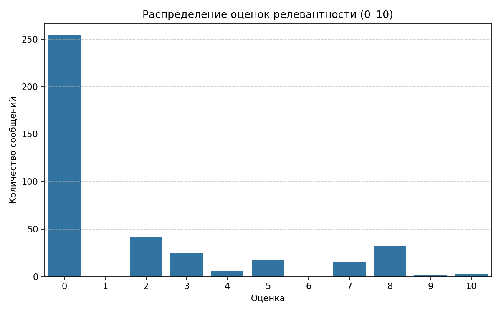

# Парсинг Telegram-канала для RAG-базы знаний

Подготовлена база знаний на основе сообщений из публичного Telegram-канала [@vse_v_shad](https://t.me/vse_v_shad), посвящённого набору в ШАД (Школу анализа данных Яндекса).

Из экспортированной истории канала были извлечены тексты сообщений, даты публикации и прямые ссылки. Затем с помощью LLM оценена релевантность каждого сообщения для автоматического ответа на вопросы о процессе поступления (этапы, даты, контакты, требования, информация о курсах, дни открытых дверей и описание треков).

Только релевантные записи (оценка ≥ 7) преобразованы в единый формат, пригодный для индексации в RAG-системе:

```json
{
  "text": "Текст сообщения...",
  "metadata": {
    "url": "https://t.me/vse_v_shad/123",
    "date": "2025-04-03T14:14:05"
  }
}
```

Распределение оценок релевантности (по шкале от 0 до 10) показано ниже:



Результат — структурированный корпус знаний, сфокусированный исключительно на информации о наборе в ШАД.